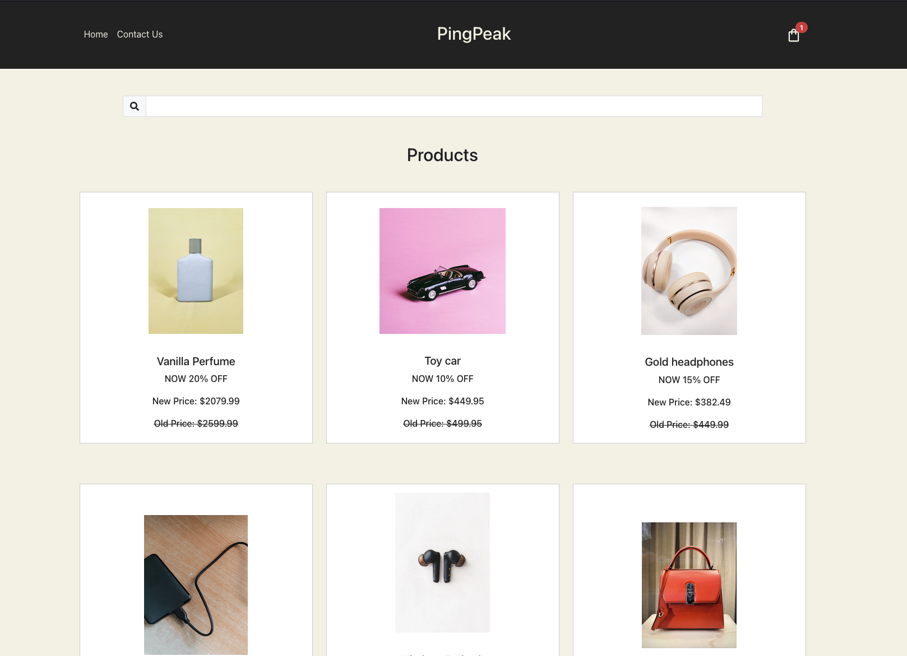

# JS Frameworks

## PingPeak eCom Store



PingPeak is a eCom store website created for a school assignment, where users can search through products and buy them. It is made with React + Vite, Zustand, Bootstrap and style components.

### Notable features

- Browse products,
- Search for products,
- View a single product,
- View product reviews,
- Add products to cart,
- View products in cart,
- Add and remove products in cart,
- Clear cart,
- Contact form.

## Build with

This website is build with React, Zustand, Bootstrap and Style components.

## Getting started

1. Clone this repository.

```
git@github.com:zalacop/eCom-store.git
```

You can run this application using your favorite server.

2. Install NPM packages

```
npm install
```

3. Start the project

```
npm start
```

4. Install React router

```
npm install react-router-dom
```

5. Install Zustand

```
npm i zustand
```

6. Install Bootstrap

```
npm install bootstrap
```

7. Install Style components

```
npm install --save styled-components
```

### Run the application

1. Start the development server

```
npm run dev
```

2. View in Browser
   Open the provided localhost link in your preferred web browser
